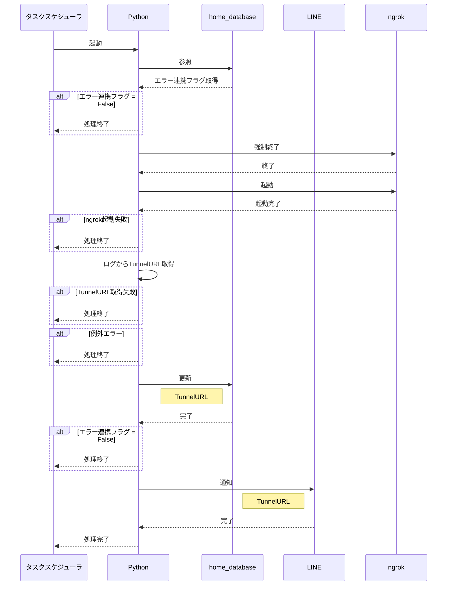

## ngrok起動

```mermaid
sequenceDiagram
    participant タスクスケジューラ
    participant Python
    participant home_database
    participant LINE
    participant ngrok

    タスクスケジューラ ->> Python: 起動
    
    Python ->> home_database: 参照
    home_database -->> Python: エラー連携フラグ取得
    alt エラー連携フラグ = False
        Python -->> タスクスケジューラ: 処理終了
    end

    Python ->> ngrok: 強制終了
    ngrok -->> Python: 終了

    Python ->> ngrok: 起動
    ngrok -->> Python: 起動完了
    alt ngrok起動失敗
        Python　-->>　タスクスケジューラ: 処理終了
    end

    Python ->> Python: ログからTunnelURL取得
    alt TunnelURL取得失敗
        Python　-->>　タスクスケジューラ: 処理終了
    end
    alt 例外エラー
        Python　-->>　タスクスケジューラ: 処理終了
    end

    Python ->> home_database: 更新
    note left of home_database: TunnelURL
    home_database -->> Python: 完了
    alt エラー連携フラグ = False
        Python -->> タスクスケジューラ: 処理終了
    end

    Python ->> LINE: 通知
    note left of LINE: TunnelURL
    LINE -->> Python: 完了

    Python　-->>　タスクスケジューラ: 処理完了
```

