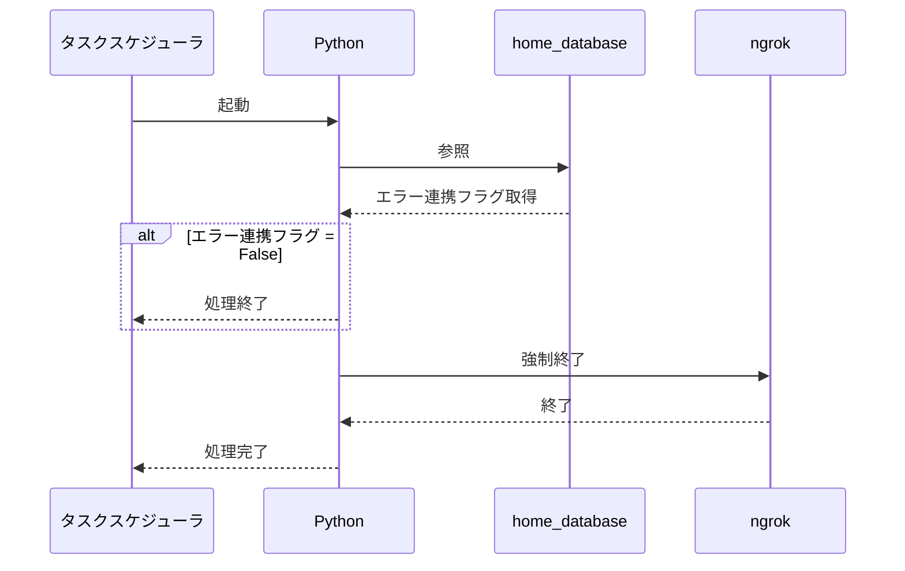

## ngrok強制停止

```mermaid
sequenceDiagram
    participant タスクスケジューラ
    participant Python
    participant home_database
    participant ngrok

    タスクスケジューラ ->> Python: 起動
    
    Python ->> home_database: 参照
    home_database -->> Python: エラー連携フラグ取得
    alt エラー連携フラグ = False
        Python -->> タスクスケジューラ: 処理終了
    end

    Python ->> ngrok: 強制終了
    ngrok -->> Python: 終了

    Python　-->>　タスクスケジューラ: 処理完了
```

