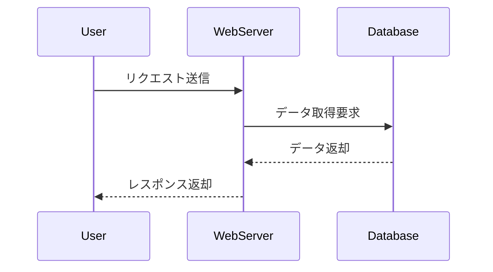

## タイトル

```mermaid
sequenceDiagram
    
    participant User
    participant WebServer
    participant Database

    User->>WebServer: リクエスト送信
    WebServer->>Database: データ取得要求
    Database-->>WebServer: データ返却
    WebServer-->>User: レスポンス返却
```

